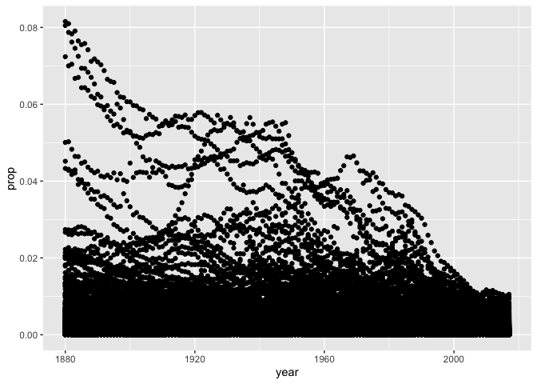

Transform Data
================

# dplyr

## Your Turn 1

Alter the code to select just the `n` column:

``` r
View(babynames)
select(babynames, n)
```

    # A tibble: 1,924,665 × 1
           n
       <int>
     1  7065
     2  2604
     3  2003
     4  1939
     5  1746
     6  1578
     7  1472
     8  1414
     9  1320
    10  1288
    # … with 1,924,655 more rows

``` r
ggplot(data = babynames)+
  geom_point(mapping = aes(x = year, y = prop))
```

<!-- -->

## Quiz

Which of these is NOT a way to select the `name` and `n` columns
together?

``` r
select(babynames, -c(year, sex, prop)) # works because it is selecting everything but year, sex, and prop
```

    # A tibble: 1,924,665 × 2
       name          n
       <chr>     <int>
     1 Mary       7065
     2 Anna       2604
     3 Emma       2003
     4 Elizabeth  1939
     5 Minnie     1746
     6 Margaret   1578
     7 Ida        1472
     8 Alice      1414
     9 Bertha     1320
    10 Sarah      1288
    # … with 1,924,655 more rows

``` r
select(babynames, name:n) # works because it is selecting everything between names and n
```

    # A tibble: 1,924,665 × 2
       name          n
       <chr>     <int>
     1 Mary       7065
     2 Anna       2604
     3 Emma       2003
     4 Elizabeth  1939
     5 Minnie     1746
     6 Margaret   1578
     7 Ida        1472
     8 Alice      1414
     9 Bertha     1320
    10 Sarah      1288
    # … with 1,924,655 more rows

``` r
select(babynames, starts_with("n")) # starts with n and none of the other variables start with n 
```

    # A tibble: 1,924,665 × 2
       name          n
       <chr>     <int>
     1 Mary       7065
     2 Anna       2604
     3 Emma       2003
     4 Elizabeth  1939
     5 Minnie     1746
     6 Margaret   1578
     7 Ida        1472
     8 Alice      1414
     9 Bertha     1320
    10 Sarah      1288
    # … with 1,924,655 more rows

``` r
select(babynames, ends_with("n")) ## n starts and ends with n but doesnt show name bc it doesnt end with n
```

    # A tibble: 1,924,665 × 1
           n
       <int>
     1  7065
     2  2604
     3  2003
     4  1939
     5  1746
     6  1578
     7  1472
     8  1414
     9  1320
    10  1288
    # … with 1,924,655 more rows

## Your Turn 2

Use `filter`, `babynames`, and the logical operators to find:

-   All of the names where prop is greater than or equal to 0.08  
-   All of the children named “Sea”

## Your Turn 3

Use Boolean operators to return only the rows that contain:

-   *Boys* named Sue  
-   Names that were used by exactly 5 or 6 children in 1880  
-   Names that are one of Acura, Lexus, or Yugo

## Help Me

What is the smallest value of n? What is the largest?

## Your Turn 4

Use `%>%` to write a sequence of functions that:

1.  Filters babynames to just the girls that were born in 2017,
    *then…*  
2.  Selects the `name` and `n` columns, *then…*  
3.  Arranges the results so that the most popular names are near the
    top.

## Your Turn 5

1.  Trim `babynames` to just the rows that contain **your** `name` and
    **your** `sex`  
2.  Trim the result to just the columns that will appear in your graph
    (not strictly necessary, but useful practice)  
3.  Plot the results as a line graph with `year` on the x axis and
    `prop` on the y axis

------------------------------------------------------------------------

# Take aways

-   Extract variables with `select()`  
-   Extract cases with `filter()`  
-   Arrange cases, with `arrange()`
